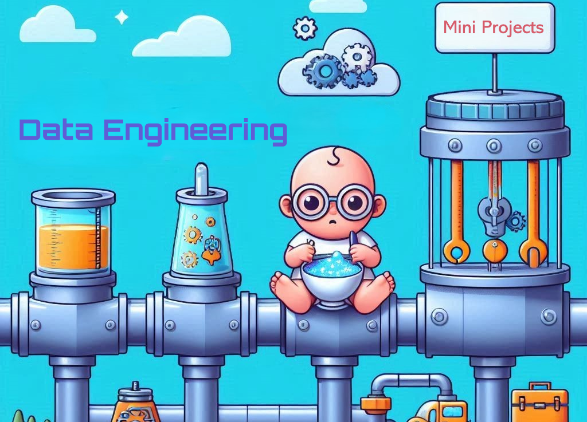

# Data Engineering mini projects
- [Data Engineering mini projects](#data-engineering-mini-projects)
    - [What's this?](#whats-this)
    - [I don't know anything about Data Engineering, can I learn it from this repo?](#i-dont-know-anything-about-data-engineering-can-i-learn-it-from-this-repo)
    - [What's the absolutely bare minimum pre-requisites needed from me to be able to follow up?](#whats-the-absolutely-bare-minimum-pre-requisites-needed-from-me-to-be-able-to-follow-up)
    - [What tools and programming languages will you use?](#what-tools-and-programming-languages-will-you-use)

### What's this?
Whenever I talk to a colleague or a friend about Data Engineering, I often detect this sense of confusion as if they communicated telepathically with me asking me, "What are you talking about? Opening an MS Excel Workbook with `pandas` you mean?!". So, I'll try to create simple **Data Engineering** projects to allow anyone who wants to know more about, and explore it to have fun and play with famous **Data Engineering** practices and tools.  

### I don't know anything about Data Engineering, can I learn it from this repo?
To some extent, yes. But I'm not designing the projects to be step-by-step guides so I guess you'll have to do some work to get all the details figured out.

### What's the absolutely bare minimum pre-requisites needed from me to be able to follow up?
You don't have to be super tech-savy, but you have to have some software development background and to be conformable around docker, git, IDEs, cloud, ..., etc. I don't think this repo will be suitable for beginners without any coding experience.

### What tools and programming languages will you use?
Essentially, anything that can add value to a Data Engineering project. But mainly, I'll use the most popular tools in the Data Engineering spectrum like Apache Spark, Kafka, Flink, ..., etc., a wide range of Databases, and some Cloud Services. As for programming languages, I'll use Python but I'll do some Rust coding as well.