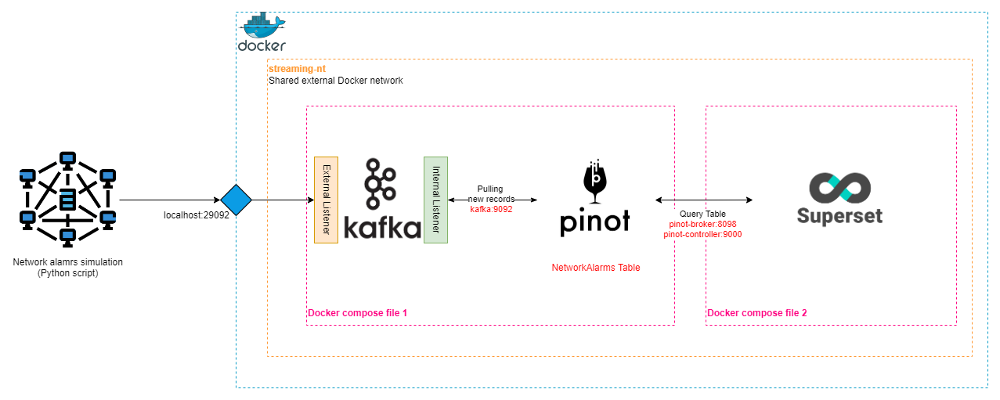
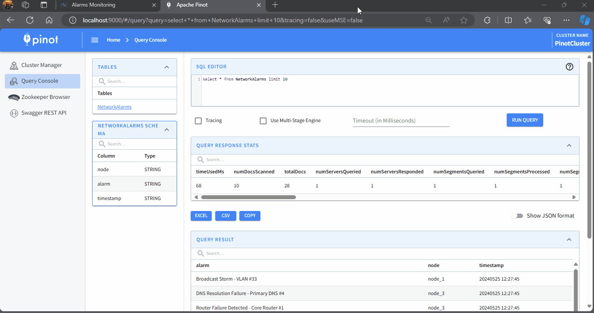
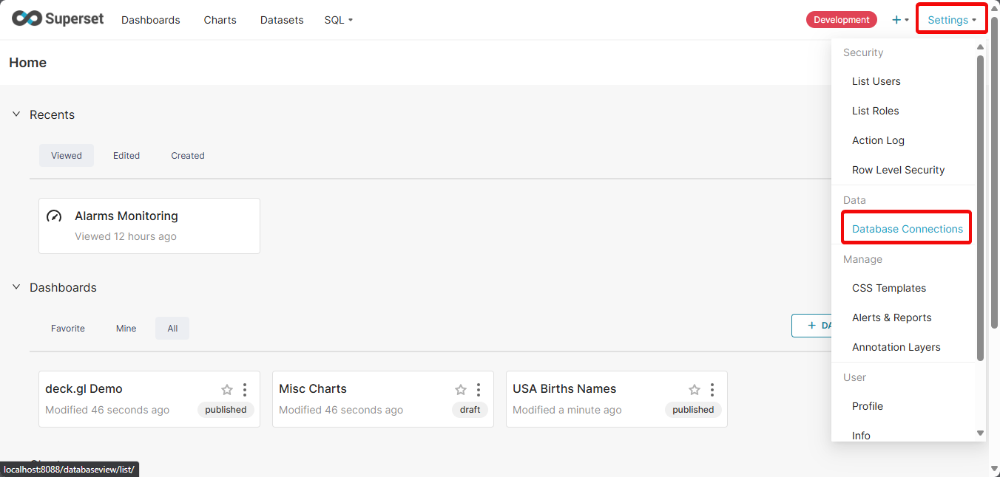
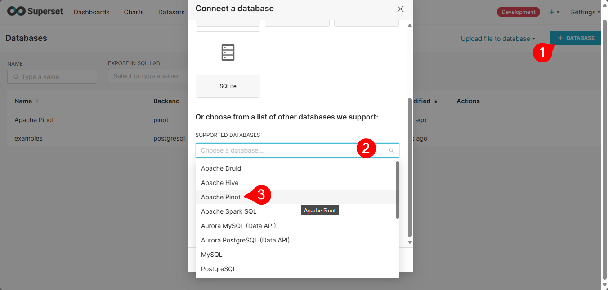
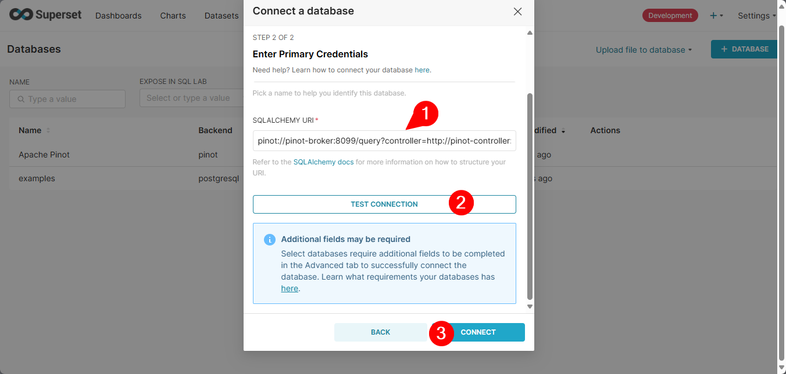
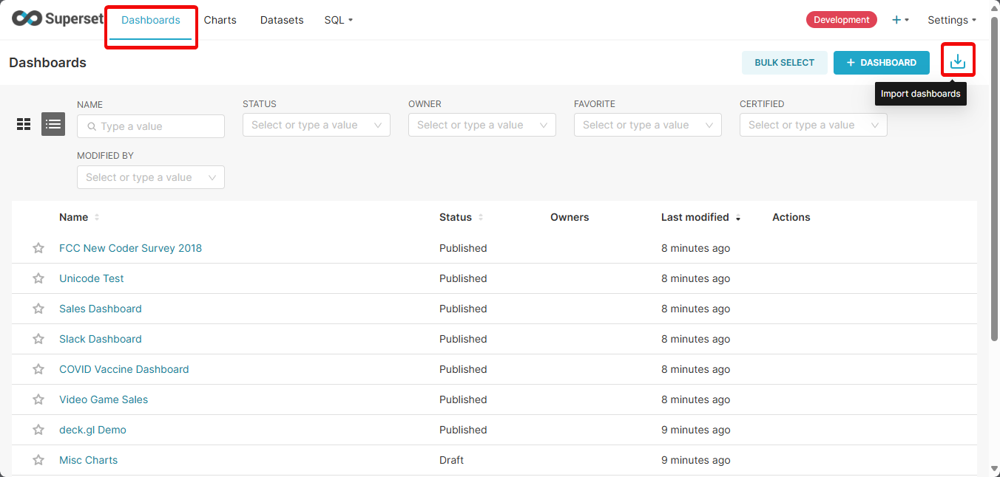
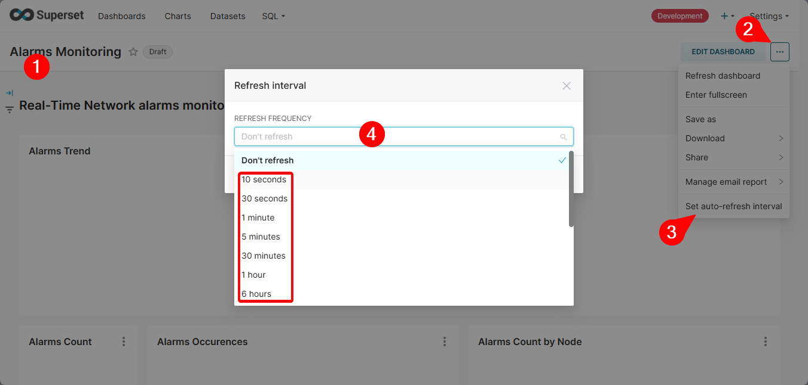
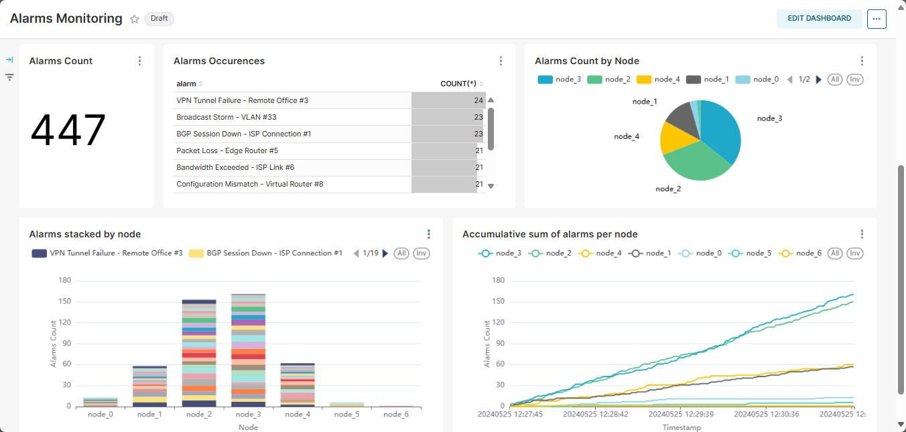

# Streaming Network Alarms Visualization
- [Streaming Network Alarms Visualization](#streaming-network-alarms-visualization)
  - [What is this project all about](#what-is-this-project-all-about)
  - [System architecture](#system-architecture)
  - [Demo](#demo)
    - [Real-time dashboard](#real-time-dashboard)
    - [Querying Pinot](#querying-pinot)
  - [Instructions](#instructions)
    - [Environment and Docker preparation](#environment-and-docker-preparation)
    - [Configuring Kafka Topic](#configuring-kafka-topic)
    - [Adding Pinot Table and Schema](#adding-pinot-table-and-schema)
    - [Downloading and Running Superset](#downloading-and-running-superset)
    - [Connection Superset to Pinot](#connection-superset-to-pinot)
    - [Running the alarms simulation and watch the Dashboard](#running-the-alarms-simulation-and-watch-the-dashboard)
    - [Stopping the project](#stopping-the-project)
  - [Things to consider if you want to make this into real-world project:](#things-to-consider-if-you-want-to-make-this-into-real-world-project)
  - [Key takeaways](#key-takeaways)
  - [References](#references)

## What is this project all about
In this project, I'll simulate a networks that has several nodes which generate alarms with a random probability that follows a normal distribution. I've used the following open-source systems to ingest, store, and visualized the received alarms:
- [Apache Kafka](https://kafka.apache.org/): A distributed *events streaming platform* used for high-performance data pipelines, streaming analytics, data integration, and mission critical applications.
- [Apache Pinot](https://pinot.apache.org/): A real-time analytics open source platform for lighting-fast insights.
- [Apache Superset](https://superset.apache.org/): An open source modern data exploration and visualization platform.

>In order to run this project, you will need a machine with at least 16GB of RAM.

## System architecture
  

This project uses containerized Kafka, Pinot, and Superset on a single host machine. Kafka is configured to use two listeners, one for external clients (the Python script) on **localhost:29092** and the other for internal clients (Apache Pinot) on the advertised host **kafka:9092**. Apache Pinot is used as an OLAP data store to serve as a lightening fast analytics engine for Apache Superset which beautifully visualized the data on Pinot. Kafka and Pinot are up using their own `docker-compose` file separate from Apache Superset as merging all three in one file would prove to be a challenge (at least for me!). This introduced a problem for Pinot and Superset communications as they are "technically" on different networks now. To overcome this, I've created a manual network inside docker and configured all the services inside both Docker compose files to use it.

## Demo
### Real-time dashboard

### Querying Pinot
  
## Instructions
I've deliberately made some of instructions needed to get this project into a working state manual instead of automating them (creating an app_init container or a script) to encourage your engagement and curiosity.
### Environment and Docker preparation
- Move into the project's directory `data-engineering-mini-projects/mini-projects/01-streaming-visualization/`
- Create the external docker network
  ```bash
  docker network create streaming-nt 
  ```
- Create a python virtual environment. Python version must be ***less*** than 3.12.
  ```bash
  python -m venv venv
  # Or if you have conda installed
  conda create -p ./venv python<3.12 -y # Python 3.12 won't work with kafka-python package
  ```
- Activate the virtual env
  ```bash
  source venv/scripts/activate # This is the windows git-bash version
  # Or with conda
  conda activate ./venv
  ```
- Install the pip requirements. This will install the `kafka-python` package needed for the alarms simulation script.
  ```bash
  pip install -r alarms_generator_script/requirements.txt
  ```
### Configuring Kafka Topic
- Spinning up the Pinot and Kafka containers using their docker compose file
  ```bash
  docker compose up -d
  ```
- Create the `network-alarms` topic 
  ```bash
  docker exec -it kafka /opt/kafka/bin/kafka-topics.sh --create --topic network-alarms --bootstrap-server kafka:9092
  ```
### Adding Pinot Table and Schema
- Copy the Pinot schema and table config files in the Pinot controller container and add them. You are welcome to take a look at those file to see how Pinot defines tables and schemas. More on that [here](https://docs.pinot.apache.org/configuration-reference/schema) and [here](https://docs.pinot.apache.org/configuration-reference/table).
  ```bash
  # Copy the schema and config files
  docker cp pinot/. pinot-controller:/tmp/pinot/

  # Use Pinot Admin Tool to add the Schema and the Table configs
  # The "\" works only in Linux. It will produce an error in a Windows environment
  # Replace it with a "`" in order to work in Powershell on Windows.
  docker exec -it pinot-controller \
    bin/pinot-admin.sh AddTable \
      -tableConfigFile /tmp/pinot/table-config-alarms.json \
      -schemaFile /tmp/pinot/schema-alarms.json \
      -controllerHost pinot-controller \
      -controllerPort 9000 \
      -exec
  ```
### Downloading and Running Superset
- Clone the Apache Superset repo
  ```bash
  git clone --depth=1  https://github.com/apache/superset.git
  ```
- Move into the newly created `superset` directory.
  ```bash
  cd superset
  ```
- Create a `docker/requirements-local.txt` inside the docker directory in the newly cloned repo folder. Write inside it `pinotdb`. This will automatically install this package needed for Pinot-Superset connection.
- Spin-up the Apache Superset docker compose file
  ```bash
  docker compose -f docker-compose-image-tag.yml up -d
  ```
  Docker compose might through errors about the `env_file` in the docker compose file needs to be of STRING type. Copy the docker compose file in `superset-local` to `superset` directory and then run it again.

### Connection Superset to Pinot
- Login to the Superset UI on `http://localhost:8088`.
- Use `admin` as both the username and password.
- Follow the illustrated instructions to add a database.
  
  
- Enter the connection string while connecting to the Pinot database. Press "Test Connection". If it passes, click Connect.
  ```
  pinot://pinot-broker:8099/query?controller=http://pinot-controller:9000/
  ```
  
- Create your own charts and dashboard or use the one in `superset-local`.
  

### Running the alarms simulation and watch the Dashboard
- Move back to the project's root directory and run the alarms simulation script. You will see a mock alarms printed on your terminal.
```bash
cd ..

# use python or python3 according to your system
python alarms_generator_script/generate_alarms.py
```
- Set the the Dashboard refresh interval as per your preference and watch it updates and ENJOY 😉
  
  

### Stopping the project
- To stop the Python alarms generator, press Ctrl + c.
- To spin-down Kafka and Pinot, go to the project's root directory and enter the following
  ```bash
  docker compose down
  ```
- To spin-down Superset
  ```bash
  docker compost -f superset/docker-compose-image-tag.yml down
  ```

## Things to consider if you want to make this into real-world project:
- This whole project, although containerized, is setup on a single host machine which isn't ideal in a production environment not to mention it defeats the purpose of using open source *distributed* systems.
- Apache Pinot storage is "ephemeral" (looses all data in case of system crash or shutdown). A "Deep Storage" system must be configured for Pinot to persist the data like Hadoop or Amazon S3. Read more [here](https://docs.pinot.apache.org/basics/data-import/pinot-file-system).
- In a production environment, the producer-Kafka should be encrypted in transit using SSL.
- Kafka, Pinot, and Superset access controls should be more restrictive.
- Superset has an **Alerts** and **Reports** that can send out both on a schedule or in response to a threshold crossing with greatly improves the response of Operations teams. Read about it [here](https://superset.apache.org/docs/configuration/alerts-reports).

## Key takeaways
- Configuring *Listeners* for Kafka in a containerized environment is super important.
- Configuring Docker networking is crucial for a mildly complex containerized setup.
- Checking systems "version" compatibility before implementing the system is very important. Initially, I was using Kafka 3.x and couldn't make it to work with Pinot only to find out that Pinot connectors only supports Kafka 2.x!
- Pay close attention to the which ports you are exposing in your docker containers.

## References
- [Apache Kafka Quick start](https://kafka.apache.org/quickstart)
- [Pinot Stream ingestion example](https://docs.pinot.apache.org/basics/getting-started/pushing-your-streaming-data-to-pinot)
- [Apache Superset Quickstart](https://superset.apache.org/docs/quickstart/)
- [Kafka Listeners - Explained](https://www.confluent.io/blog/kafka-listeners-explained/)