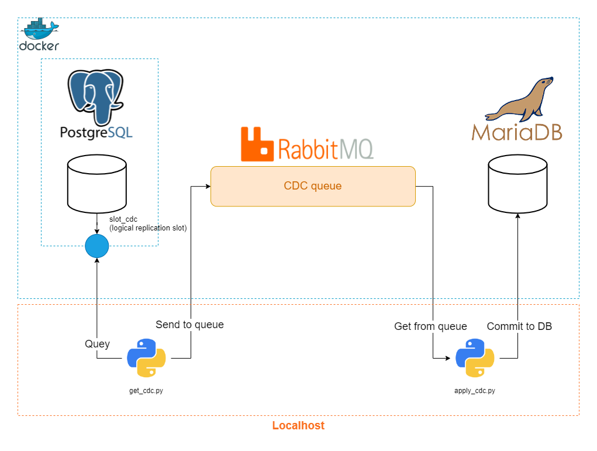

# Replicate a Postgresql table into MariaDB using logical replication implementing a CDC data pipeline
- [Replicate a Postgresql table into MariaDB using logical replication implementing a CDC data pipeline](#replicate-a-postgresql-table-into-mariadb-using-logical-replication-implementing-a-cdc-data-pipeline)
  - [What is this project all about](#what-is-this-project-all-about)
  - [System architecture](#system-architecture)
  - [Demo](#demo)
  - [Instructions](#instructions)
    - [Environment and Docker preparation](#environment-and-docker-preparation)
    - [Creating and starting the logical replication slot](#creating-and-starting-the-logical-replication-slot)
    - [Staring the `get_cdc.py` and `apply_cdc.py` scripts](#staring-the-get_cdcpy-and-apply_cdcpy-scripts)
    - [Accessing Databases](#accessing-databases)
    - [Applying INSERT, UPDATE, and DELETE to Postgresql and watch it flows to MariaDB](#applying-insert-update-and-delete-to-postgresql-and-watch-it-flows-to-mariadb)
    - [Stopping the project](#stopping-the-project)
    - [\[Bonus\] Other useful commands/queries](#bonus-other-useful-commandsqueries)
  - [Things to consider if you want to make this into real-world project:](#things-to-consider-if-you-want-to-make-this-into-real-world-project)
  - [Key takeaways](#key-takeaways)
  - [References](#references)

## What is this project all about
I built this project to explore the [Postgresql](https://www.postgresql.org/) **Logical Decoding** feature where the DBMS essentially streams the DML  (Data Manipulation language, i.e. INSERT, UPDATE, and DELETE) changes. I used this "changes stream" to create a CDC (Change Data Capture) pipeline that uses [RabbitMQ](https://www.rabbitmq.com/) as a queue for DML changes that happens to one table in Postgresql and then, apply those changes to a table with the same name in [MariaDB](https://mariadb.com/).  


## System architecture
  
In order to use the **Logical Decoding** feature in Postgresql, something called *Logical Replication Slot* must be created first. This is the entry point that external consumers and applications can query to get the *streaming changes*.  
  
A Python script then *queries* this replication slot, does some light processing on the result, and then, sends the payload to the *queue* to be *asynchronously* processed by a consumer application as they are "loosely coupled" which also gives the system some fault tolerance features.  
  
Another Python script pulls the "change messages" from the queue, parses the payload, and finally commits the changes to the MariaDB's table.  
  
The replication slot uses the [wal2json](https://github.com/eulerto/wal2json) plugin to stream the changes in JSON format. The plugin is installed and initiated in the Postgresql container.  
  
Both the **Postgresql** and the **MariaDB** databases are initiated to have `requets` database and an `itrequests` table.  
  
W
## Demo

## Instructions
I've deliberately made some of instructions needed to get this project into a working state manual instead of automating them (creating an app_init container or a script) to encourage your engagement and curiosity.
### Environment and Docker preparation
- Move into the project's directory `data-engineering-mini-projects/mini-projects/02-postgresql-to-mariadb-replication-with-cdc/`
- Create a python virtual environment.
  ```bash
  python -m venv venv
  # Or if you have conda installed
  conda create -p ./venv -y
  ```
- Activate the virtual env
  ```bash
  source venv/scripts/activate # This is the windows git-bash version
  # Or with conda
  conda activate ./venv
  ```
- Install the pip requirements.
  ```bash
  pip install -r ./requirements.txt
  ```
### Creating and starting the logical replication slot
- Spinning up the project using docker compose file
  ```bash
  docker compose up -d
  ```
- Create the `cdc_slot` logical replication slot 
  ```bash
  docker compose exec postgresqldb bash -c "pg_recvlogical -U postgres -d requests --slot slot_cdc --create-slot -P wal2json"
  ```
- Starting it 
  ```bash
  docker compose exec postgresqldb bash -c "pg_recvlogical -U postgres -d requests --slot slot_cdc --start -f -&"
  ```
### Staring the `get_cdc.py` and `apply_cdc.py` scripts
- In a new terminal window, type the following to start the `get_cdc.py` script that will query the **Postgresql** logical replication slot for changes.
  ```bash
  python ./scripts/get_cdc.py
  ```
- In another terminal window, type the following to start the `apply_cdc.py` script that will get "changes messages" from the queue and apply them to **MariaDB**.
  ```bash
  python ./scripts/apply_cdc.py
  ```
### Accessing Databases
- Type the following in a new terminal window to access the Postgresql container and the DB server
  ```bash
  docker compose exec postgresqldb bash
  ```
  then in the container
  ```bash
  psql -U postgres -d requests
  ```
- Do the same for MariaDB in a new terminal window.
  ```bash
  docker compose exec mariadb bash
  ```
  then in the container
  ```bash
  mariadb -h localhost -P 3306 -u mariadb -pmariadb requests
  ```
### Applying INSERT, UPDATE, and DELETE to Postgresql and watch it flows to MariaDB
- Use the file `./postgresql/db-changes-demo.sql` to play around with some DML queries. Execute those in the `psql` shell and watch them flow to MariaDB. You also can watch the changes in JSON format flowing through the `get_cdc` and `apply_cdc` scripts windows.

### Stopping the project
- To stop the Python scripts, press Ctrl + c.
- To spin-down the project, enter the following
  ```bash
  docker compose down
  ```

### [Bonus] Other useful commands/queries
- To "take a peek" at the changes stream and don't consume it (it will remain in the DB and won't be deleted)
  ```sql
  SELECT * FROM pg_logical_slot_peek_changes('slot_cdc', NULL, NULL);
  ```
- To consume the changes stream (it will be deleted after executing the query)
  ```sql
  SELECT * FROM pg_logical_slot_get_changes('slot_cdc', NULL, NULL);
  ```
- To drop a replication slot
  ```bash
  pg_recvlogical -U postgres -d requests --slot slot_cdc --drop-slot
  ```
- To view the current replication slots from `psql` shell
  ```sql
  SELECT slot_name, slot_type, database, active
  FROM pg_replication_slots;
  ```

## Things to consider if you want to make this into real-world project:
- All the components must be security hardened via tighter user control, management, and permissions.
- The scripts could have be it their own containers as well, but I was focusing more on implementing CDC.
- Some observability features should be in-place as the scripts, specially the `get_cdc`, could cause problems if queried the replication slot but failed to send the messages to the queue as those messages will be lost.
- A better alternative to **RabbitMQ** is **Apache Kafka** as it will support backfilling natively.

## Key takeaways
- **Postgresql** has both, a physical and logical replication slots. The logical one is used to stream the DML changes for external application for replication and auditing proposes.
- The "Logical Decoding" only streams *DML* changes. Meaning other *DDL* (Data Definition Language) like DROP, CREATE, ..., etc. won't be streamed.
- Both **Postgresql** and **MariaDB** Docker images has a `/docker-entrypoint-initdb.d/` directory that the db engine will execute what's inside it. I used to initiate the dbs.
## References
- [Postgresql Logical Replication](https://www.postgresql.org/docs/current/logicaldecoding.html)
- [Logical Decoding example](https://techcommunity.microsoft.com/t5/azure-database-for-postgresql/change-data-capture-in-postgres-how-to-use-logical-decoding-and/ba-p/1396421)
- [Postgres CDC example](https://dev.to/thiagosilvaf/how-to-use-change-database-capture-cdc-in-postgres-37b8)
- [RabbitMQ python guide](https://www.rabbitmq.com/tutorials/tutorial-one-python)