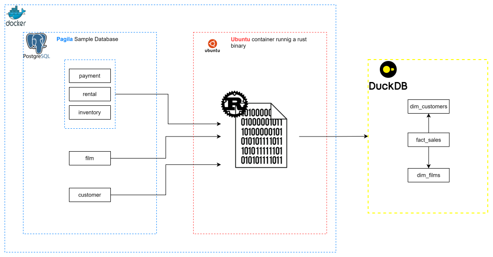
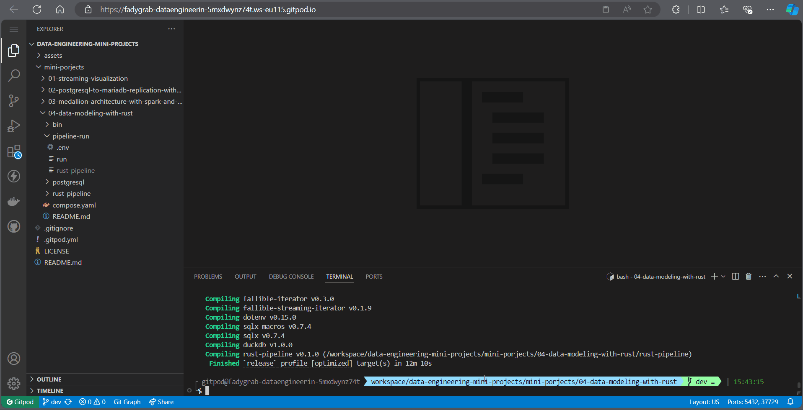

# Data Modeling with Rust
- [Data Modeling with Rust](#data-modeling-with-rust)
  - [What is this project all about](#what-is-this-project-all-about)
  - [System architecture](#system-architecture)
  - [Demo](#demo)
  - [Instructions](#instructions)
  - [Stopping the project](#stopping-the-project)
  - [Things to consider if you want to make this into real-world project](#things-to-consider-if-you-want-to-make-this-into-real-world-project)
  - [Key takeaways](#key-takeaways)
  - [References](#references)
 
## What is this project all about
In this project, I've implemented the [Star Schema](https://en.wikipedia.org/wiki/Star_schema) where you organize your data into *Fact* and *Dimension* tables. This format is preferable in the BI and data warehousing applications. What's new here, is that I've used *Rust* for the ETL pipeline to load the data into *DuckDB*.

## System architecture

I'm using the [pagila](https://github.com/devrimgunduz/pagila) sample postgresql database. This database is the Postgres port of the Sakila example database for MySQL. I've used the initiation scripts in teh `postgresql` directory for it. It's about a film rental service and how it relational model could be implemented. For the ETL, I've compiled a Rust binary that does the Extraction from the Postgres DB, Transforms the tables into Facts and Dimensions tables, and finally Loads them into [DuckDB](https://duckdb.org/) (as per their official website, DuckDB is a fast in-process analytical database).
The final tables in DuckDB, are the *fact_sales*, *dim_customers*, and *dim_films*. This allows for easy financial BI analysis regarding the films library and customers base. 

## Demo

## Instructions
This time, I'm using a CDE (Cloud Development Environment). I've used [GitPod](https://gitpod.io/workspaces) for this project but [Github Codespaces](https://github.com/features/codespaces) is a viable option too. If you are using Gitpod, start your Instance in the *main* branch of the repo and follow the instructions:

- Go to the project's root directory.
  ```bash
  cd mini-porjects/04-data-modeling-with-rust
  ```
- Start only the Postgres DB so we can compile the rust binary
  ```bash
  docker compose up postgres -d
- Start the deploy script so we can compile and copy the binary in the pipeline directory (this could take a while)
  ```bash
  bin/deploy
  ```
- After a successful built, we can now start the pipeline which is an *Ubuntu* container with the rust binary we've just built.
  ```bash
  docker compose up pipeline
  ```
- You will notice that the pipeline container stops after it finishes and you will get `pipeline-run/duckdb/` directory containing the *DuckDB* file.
- (Optional) You can verify from the stopped pipeline container logs that the binary has extracted, transomed, and loaded the data.
- To be able to explore the resulting *DuckDB* file, we need the DuckDB CLI. Execute this script to get it.
  ```bash
  bin/get-duckdb
  ```
- To open the DuckDB file, enter the following
  ```bash
  sudo chmod 777 pipeline-run/duckdb/pagila_sales.duckdb 
  bin/duckdb pipeline-run/duckdb/pagila_sales.duckdb
  ```
- (Optional) Try the following to explore the file
  ```sql
  .help --to get the list of available commands
  .tables --to get the list of tables
  SELECT * FROM fact_sales LIMIT 10; --to get the first 10 record form the fact_sales table.
  -- ....
  ```

## Stopping the project
Type `docker compose down` to stop the docker containers and don't forget to stop the instance if you are using a CDE.

## Things to consider if you want to make this into real-world project
- The binary container could be run on a schedule (via crontab for example) to enable batch processing.
- Incremental loading should be applied to avoid loading the whole DB each time the pipeline runs especially if the DB is expanding rapidly.
- If the dimensions are changing, a proper SCD (slowly changing dimension) strategy should be applied.

## Key takeaways
- DuckBD is very hard to visualize using mainstream BI tools like Power BI or Apache Superset.
- The footprint of the rust binary is minimal. The pipeline image size was less than 80 MB in size!
- The pipeline finishes very fast (in around 6 seconds in my CDE instance) for collecting ~ 18K records.
- Rust for ETL workloads is straightforward. But you have be familiar with Rust syntax first.

## References
All the used tool official docs.